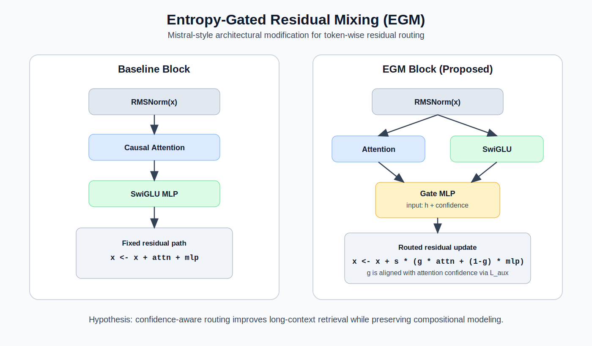

# Entropy-Gated Residual Mixing for Mistral-Style Decoders



- Baseline Mistral-style block: pre-norm -> attention residual -> MLP residual
- Proposed block (**EGM**): pre-norm -> attention + MLP in parallel -> token-wise gated residual mix

The gate is conditioned on **attention confidence** (1 - normalized attention entropy), so the model learns:

- high-confidence retrieval tokens -> favor attention update
- low-confidence tokens -> favor MLP/world-modeling update

## Quickstart (uv)

```bash
uv sync
```

### Train baseline

```bash
uv run tilde-train --variant baseline --optimizer adamw --steps 3000
```

### Train modified architecture (EGM)

```bash
uv run tilde-train --variant egm --optimizer muon --steps 3000
```

### Run ablation end-to-end

```bash
uv run tilde-ablate --steps 3000 --optimizer muon
```

Outputs are saved under `runs/<run_name>/`:

- `metrics.csv`
- `best.pt`
- `config.json`

### Trigger cloud ablation

```bash
gh workflow run ablation.yml \
  -f steps=3000 \
  -f batch_size=64 \
  -f eval_batches=50 \
  -f eval_interval=200 \
  -f optimizer=muon
```

### Monitor + download results

```bash
gh run list --workflow ablation.yml --limit 5
gh run watch
gh run download --name ablation-runs
```

## Repo structure

- `src/tilde_winner/model.py`: baseline + EGM transformer blocks
- `src/tilde_winner/optim.py`: Muon-like gradient orthogonalization optimizer
- `src/tilde_winner/data.py`: synthetic long-context retrieval generator
- `src/tilde_winner/train.py`: training/eval loop
- `src/tilde_winner/ablate.py`: baseline vs EGM runner
- `submission_pitch.md`: short submission narrative for judges
